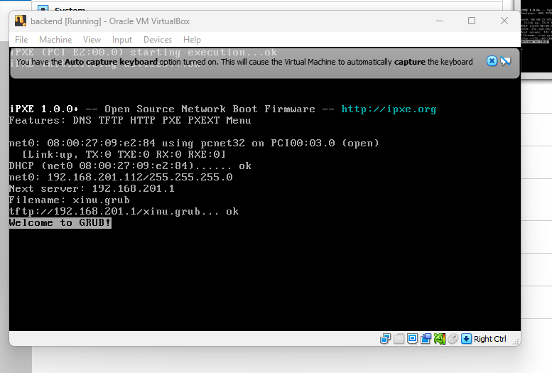

# <h1 align="center">Laporan Praktikum Modul 02   Instalasi Xinu</h1>

Mei sari mantiantini - 2311104012

## Dasar Teori

Xinu (Xinu Is Not Unix) adalah sistem operasi sederhana yang biasanya digunakan untuk pembelajaran, khususnya untuk memahami konsep dasar sistem operasi seperti manajemen proses, memori, dan komunikasi antar proses. Xinu sering dipakai di lingkungan akademik karena strukturnya lebih sederhana dibanding sistem operasi modern seperti Windows atau Linux.

Dalam praktikum ini, Xinu dijalankan menggunakan virtual machine (VM) agar tidak perlu menginstal langsung ke perangkat keras asli. VM memungkinkan kita menjalankan sistem operasi di dalam sistem operasi lain secara virtual.

## Guided

## Referensi

1. https://telkomuniversityofficial-my.sharepoint.com/personal/maghaz_student_telkomuniversity_ac_id/_layouts/15/onedrive.aspx?id=%2Fpersonal%2Fmaghaz%5Fstudent%5Ftelkomuniversity%5Fac%5Fid%2FDocuments%2F2026%2F00%2E%20Modul%20Praktikum%20Sistem%20Operasi%20SE%202526%2D2%2Epdf&parent=%2Fpersonal%2Fmaghaz%5Fstudent%5Ftelkomuniversity%5Fac%5Fid%2FDocuments%2F2026&ga=1

