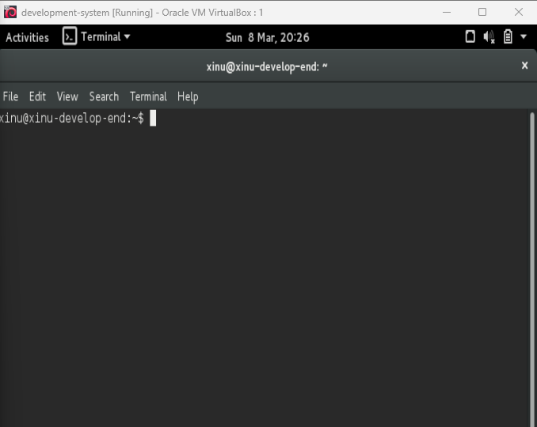
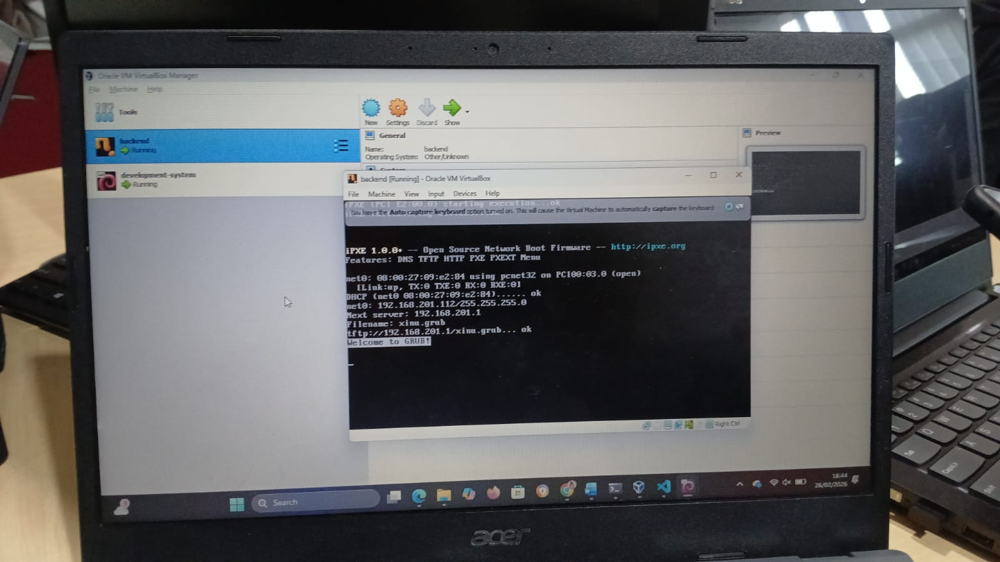

# <h1 align="center">Laporan Praktikum Modul 03   Eksplorasi Xinu</h1>

Mei sari mantiantini - 2311104012

## Dasar Teori

Xinu (Experimental Internetworking Operating System) adalah sistem operasi sederhana yang dikembangkan untuk tujuan pembelajaran mengenai konsep dasar sistem operasi. Xinu digunakan untuk mempelajari bagaimana sistem operasi bekerja secara langsung, seperti pengelolaan proses, memori, dan komunikasi antar proses. Dengan menggunakan Xinu, mahasiswa dapat memahami struktur dan mekanisme kerja sistem operasi secara lebih mendalam melalui praktik langsung.

Dalam eksplorasi Xinu, pengguna dapat menjalankan berbagai perintah untuk melihat dan mengelola proses yang berjalan di sistem. Beberapa perintah yang sering digunakan antara lain untuk menampilkan daftar proses, melihat status sistem, serta mengontrol proses yang sedang berjalan. Melalui eksplorasi ini, mahasiswa dapat memahami bagaimana sistem operasi mengatur sumber daya komputer dan menjalankan berbagai proses secara efisien.

## Guided
Langkah - langkah :
  1. Buka virtualBox dan start development
  2. Login pada development system vm menggunakan passwaord xinurocks
  3. Setelah berhasil akan muncul
     
  4. Berpindah ke Backend VM. Jalankan virtualbox kemudian “Start” virtual machine backend.
     

## Unguided
  1. Berapa jumlah perintah pada Xinu?
     13 perintah.

  2. Sebutkan 2 perintah yang mempunyai fungsi yang sama!
     exit dan logout, karena keduanya sama-sama digunakan untuk keluar dari shell Xinu.

  3. Berapa IP address Xinu?
     192.168.1.2.

  4. Perintah apa yang digunakan untuk mengetahui IP address?
     Perintah yang digunakan adalah ipconfig.

  5. Berapa IP DNS server yang digunakan oleh Xinu?
     8.8.8.8.

  6. Terdapat berapa proses yang sedang berjalan pada Xinu?
     Biasanya terdapat sekitar 10 proses yang sedang berjalan.

  7. Proses apa yang mempunyai prioritas paling rendah?
     Proses dengan prioritas paling rendah adalah null process.

  8. Proses apa yang mempunyai ukuran paling besar?
     Biasanya proses dengan ukuran paling besar adalah main process.

  9. Proses apa yang berada dalam state current?
     main process.

  10. Proses apa yang berada dalam state suspend?
     shell process.

  11. Berapa PID (Process ID) dari Main process?
     PID dari main process biasanya adalah 1.

## Referensi

1. https://telkomuniversityofficial-my.sharepoint.com/personal/maghaz_student_telkomuniversity_ac_id/_layouts/15/onedrive.aspx?id=%2Fpersonal%2Fmaghaz%5Fstudent%5Ftelkomuniversity%5Fac%5Fid%2FDocuments%2F2026%2F00%2E%20Modul%20Praktikum%20Sistem%20Operasi%20SE%202526%2D2%2Epdf&parent=%2Fpersonal%2Fmaghaz%5Fstudent%5Ftelkomuniversity%5Fac%5Fid%2FDocuments%2F2026&ga=1

