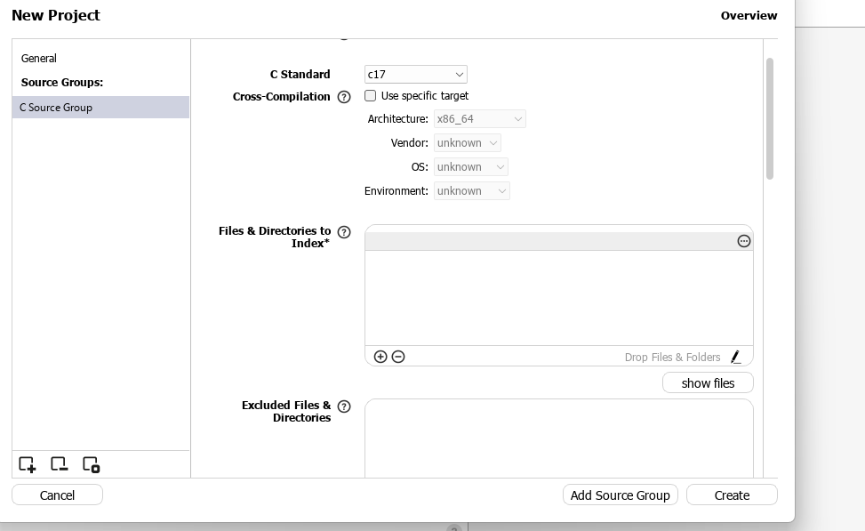
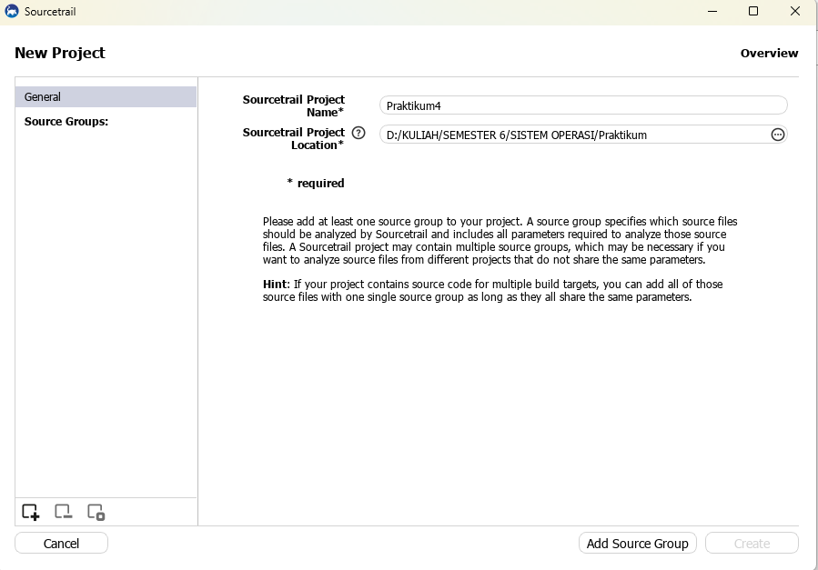
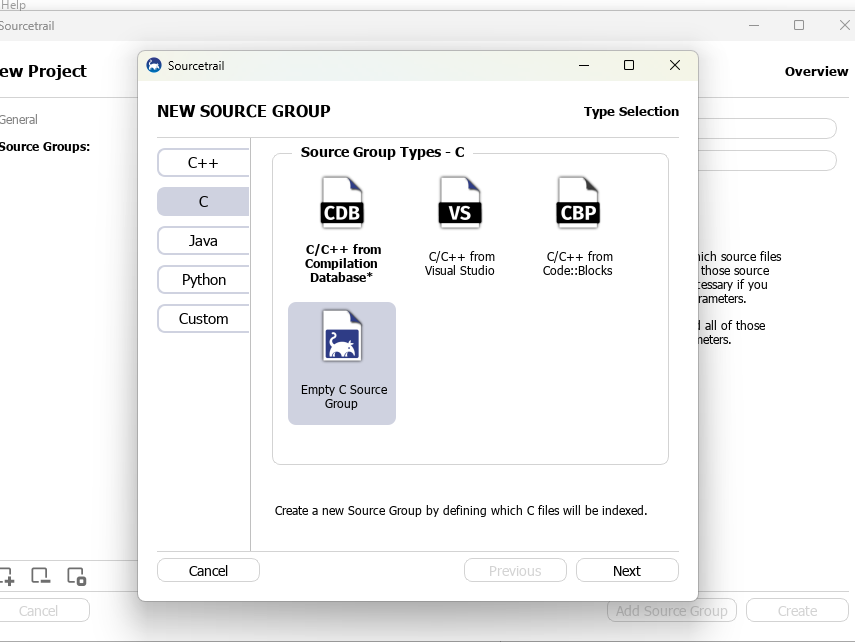
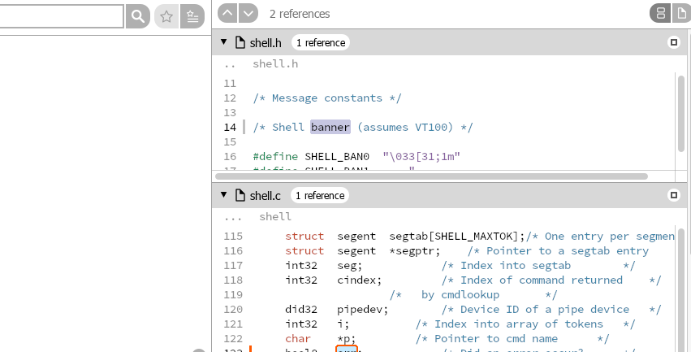
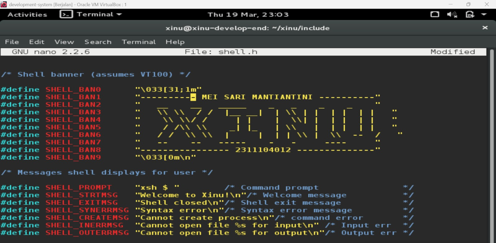
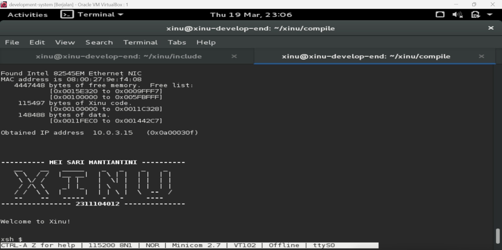

# <h1 align="center">Laporan Praktikum Modul 04   Membaca source code xinu</h1>

Mei sari mantiantini - 2311104012

## Dasar Teori

Xinu (Xinu Is Not Unix) merupakan sistem operasi yang dirancang untuk lingkungan embedded system. Dalam pengembangannya, Xinu menggunakan paradigma cross-development, yaitu proses pengembangan dilakukan pada komputer host (PC/laptop) dengan sistem operasi umum seperti Linux atau Windows, kemudian hasilnya berupa file image dijalankan pada perangkat target (embedded system).

Bahasa pemrograman utama yang digunakan dalam Xinu adalah bahasa C, karena memiliki kemampuan low-level yang memungkinkan interaksi langsung dengan perangkat keras. Hal ini sangat penting dalam pengembangan sistem operasi yang membutuhkan kontrol penuh terhadap resource hardware.
Struktur source code Xinu tersusun secara modular dalam beberapa direktori utama, seperti:
-compile: proses kompilasi dan linking menggunakan Makefile
-config & device: konfigurasi sistem dan implementasi device driver
-include: header file yang berisi deklarasi fungsi dan struktur data
-system: inti kernel Xinu (manajemen proses, scheduler, dll)
-shell: implementasi command-line interface
-lib & net: fungsi pustaka dan protokol jaringan

Dalam Xinu, berbagai komponen sistem seperti proses, semaphore, memori, dan komunikasi antar proses direpresentasikan melalui file header khusus (misalnya process.h, semaphore.h). Selain itu, mekanisme penting seperti scheduler (resched.c) dan context switch (ctxsw.S) berperan dalam pengelolaan eksekusi proses.
Konsep system call (syscall) digunakan sebagai antarmuka antara program pengguna dengan kernel, di mana setiap syscall biasanya diimplementasikan dalam file terpisah di direktori system.
Xinu juga menerapkan konvensi khusus dalam penamaan tipe data untuk menjamin konsistensi ukuran data dan fungsinya, sehingga lebih portabel di berbagai arsitektur.

## Guided
Langkah - langkah :
  1. Buka virtualBox dan start development
  2. Login pada development system vm menggunakan passwaord xinurocks
  3. Setelah berhasil akan muncul
     
  4. Berpindah ke Backend VM. Jalankan virtualbox kemudian “Start” virtual machine backend.
     

## Unguided
  1. Apa nama image yang dihasilkan setelah melakukan kompilasi pada Xinu? Berapa ukuran file tersebut? Ada pada folder apa file image tersebut? 
  Jawab : 
  Setelah proses kompilasi pada sistem operasi Xinu selesai, akan dihasilkan sebuah file image kernel yang umumnya bernama xinu.elf, meskipun pada beberapa konfigurasi bisa juga berupa xinu.bin. File ini merupakan hasil build utama yang nantinya digunakan untuk dijalankan atau di-boot pada sistem. Ukuran file image tersebut biasanya berada pada kisaran ratusan kilobyte hingga beberapa megabyte, tergantung pada fitur dan modul yang disertakan saat kompilasi, dengan ukuran umum sekitar 500 KB hingga 2 MB. File image ini dapat ditemukan di dalam folder compile/, yang merupakan direktori tempat semua hasil kompilasi disimpan, sehingga path lengkapnya biasanya berupa compile/xinu.elf.

  2. 
     
     
  3. Carilah struktur data dari proses pada Xinu OS. Struktur data proses ada pada file apa? Informasi apa saja yang disimpan dalam struktur data tersebut? 
  Hint: file berektensi .h 
  Pada Linux bisa digunakan perintah “grep”
  Contoh:
  $ grep -r “kata_yang_ingin_dicari” /path/ke/direktori/tempat/file/berada
  Jawab :
  Struktur data proses pada Xinu OS terdapat pada file process.h yang berada di direktori include. Struktur ini bernama procent dan berfungsi untuk menyimpan seluruh informasi penting terkait proses, seperti ID proses, status, prioritas, stack, komunikasi antar proses, serta informasi input/output. 

4.  
    

5. 

## Referensi

1. https://telkomuniversityofficial-my.sharepoint.com/personal/maghaz_student_telkomuniversity_ac_id/_layouts/15/onedrive.aspx?id=%2Fpersonal%2Fmaghaz%5Fstudent%5Ftelkomuniversity%5Fac%5Fid%2FDocuments%2F2026%2F00%2E%20Modul%20Praktikum%20Sistem%20Operasi%20SE%202526%2D2%2Epdf&parent=%2Fpersonal%2Fmaghaz%5Fstudent%5Ftelkomuniversity%5Fac%5Fid%2FDocuments%2F2026&ga=1

