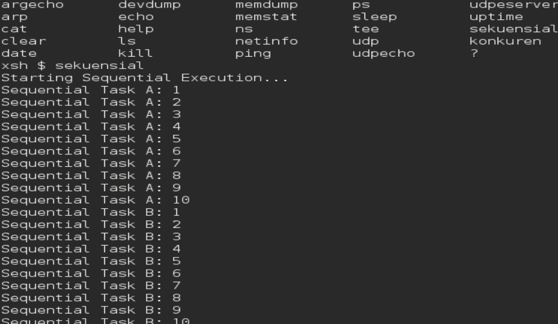
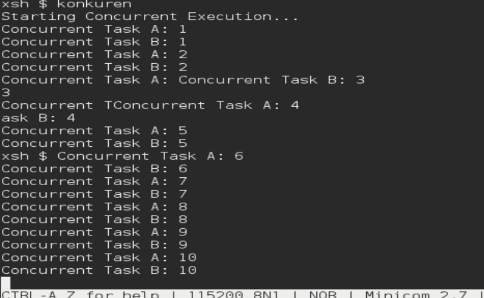

# <h1 align="center">Laporan Praktikum Modul 06   Sekuensial dan konkuren</h1>

Mei sari mantiantini - 2311104012

## Dasar Teori

Dalam Sistem Operasi, terdapat dua konsep utama dalam eksekusi program, yaitu sekuensial dan konkuren. Program sekuensial dijalankan secara berurutan, di mana setiap instruksi dieksekusi satu per satu sesuai alur kode. Pada model ini, CPU hanya menangani satu proses dalam satu waktu, sehingga apabila terdapat fungsi dengan perulangan tak hingga, maka bagian program lain tidak akan pernah dijalankan. Hal ini terlihat pada implementasi di Xinu, di mana fungsi seperti sndA() yang berjalan terus-menerus akan menghambat eksekusi fungsi lain seperti sndB(), sehingga program tidak berjalan secara bersamaan.
Sebaliknya, konsep konkuren memungkinkan beberapa proses berjalan secara bersamaan melalui mekanisme yang diatur oleh sistem operasi. Pada sistem dengan satu CPU, konkurensi dicapai menggunakan teknik time slicing dalam Multitasking, sehingga CPU berpindah dengan cepat antar proses dan menciptakan ilusi paralelisme. Dalam Xinu, proses baru dapat dibuat menggunakan system call create() dan dijalankan dengan resume(), sehingga beberapa proses seperti pencetakan karakter “A” dan “B” dapat berjalan bergantian. Pendekatan ini meningkatkan efisiensi penggunaan CPU dan memungkinkan sistem menangani banyak tugas secara lebih optimal dibandingkan metode sekuensial.

## Hasil
1. perubahan batas maksimal jumlah proses pada sistem operasi Xinu tidak dilakukan dari tampilan shell xsh yang sedang kamu gunakan, melainkan harus dilakukan langsung pada source code Xinu. Langkahnya adalah dengan membuka folder project Xinu di komputer, kemudian mencari file header seperti process.h atau conf.h yang biasanya berada di dalam folder include. Di dalam file tersebut terdapat konstanta NPROC yang menentukan jumlah maksimal proses, misalnya #define NPROC 50. Nilai ini kemudian diubah menjadi #define NPROC 150 sesuai permintaan soal. Setelah perubahan disimpan, sistem harus di-compile ulang menggunakan perintah seperti make clean dan make, lalu Xinu dijalankan kembali. Perubahan ini tidak bisa dilakukan langsung dari terminal xsh karena NPROC merupakan bagian dari konfigurasi kernel yang hanya bisa diubah pada saat kompilasi, bukan saat sistem sudah berjalan.
2.  
   
3.  

4.  hasil program terlihat “mengejutkan” karena terjadi race condition, yaitu kondisi ketika dua proses mengakses dan memodifikasi data yang sama secara bersamaan tanpa pengaturan sinkronisasi. Pada program tersebut, variabel n dideklarasikan sebagai variabel global yang digunakan oleh dua proses, yaitu produser yang melakukan increment (n++) dan konsumer yang membaca serta mencetak nilai n. Ketika kedua proses dijalankan secara konkuren, eksekusi keduanya bisa saling tumpang tindih sehingga urutan operasi tidak lagi terjamin. Selain itu, operasi n++ bukanlah operasi atomik karena terdiri dari beberapa langkah (membaca nilai, menambah, lalu menyimpan kembali), sehingga sangat mungkin terjadi interupsi di tengah proses tersebut. Akibatnya, nilai n yang dibaca oleh konsumer bisa tidak konsisten, misalnya tidak berurutan, meloncat-loncat, atau bahkan muncul nilai yang sama berulang kali. Hal ini menyebabkan hasil yang ditampilkan tidak sesuai dengan intuisi awal yang mengharapkan nilai meningkat secara teratur. Oleh karena itu, untuk mendapatkan hasil yang benar dan konsisten, diperlukan mekanisme sinkronisasi seperti semaphore atau mutex agar akses terhadap variabel n dapat dikontrol

## Referensi

1. https://telkomuniversityofficial-my.sharepoint.com/personal/maghaz_student_telkomuniversity_ac_id/_layouts/15/onedrive.aspx?id=%2Fpersonal%2Fmaghaz%5Fstudent%5Ftelkomuniversity%5Fac%5Fid%2FDocuments%2F2026%2F00%2E%20Modul%20Praktikum%20Sistem%20Operasi%20SE%202526%2D2%2Epdf&parent=%2Fpersonal%2Fmaghaz%5Fstudent%5Ftelkomuniversity%5Fac%5Fid%2FDocuments%2F2026&ga=1