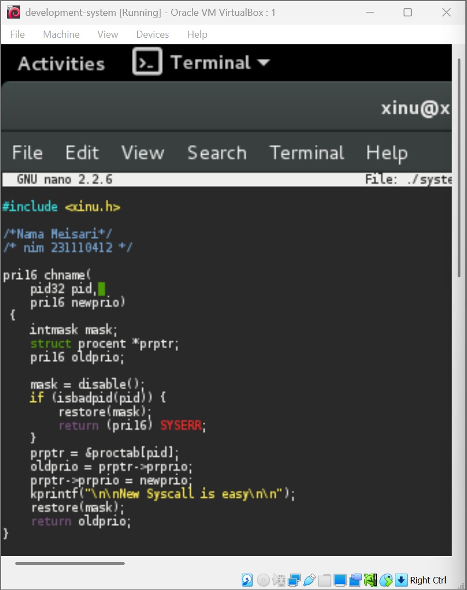
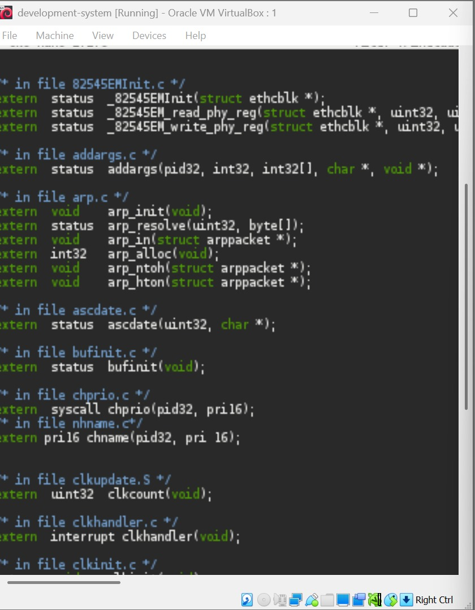
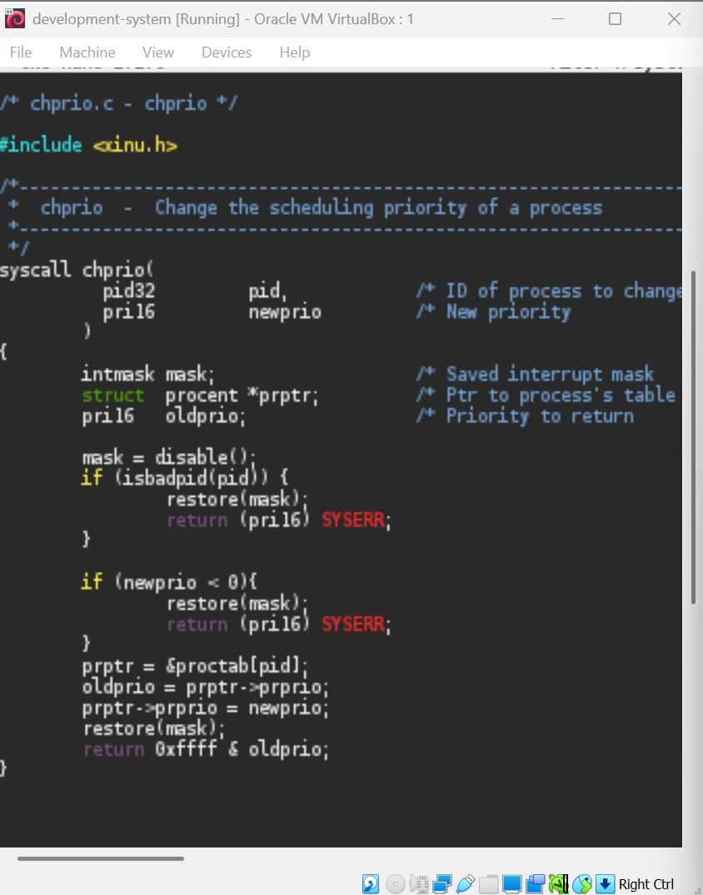
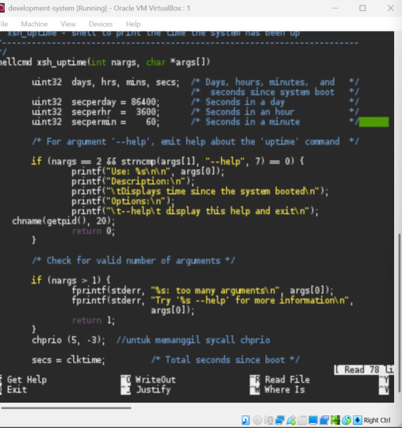
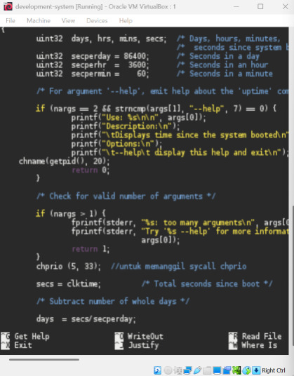

# <h1 align="center">Laporan Praktikum Modul 09   Update syscall</h1>

Mei sari mantiantini - 2311104012

## Dasar Teori

XINU XINU ("X is Not Unix") adalah kernel sistem operasi komputer yang dikembangkan di Apple Inc. sejak Desember 1996 untuk digunakan dalam sistem operasi Mac OS X (sekarang macOS) dan dirilis sebagai perangkat lunak bebas dan sumber terbuka sebagai bagian dari OS Darwin

## Hasil
1. 
   
2. [25 Poin] Perbaiki syscall chprio (xinu/system/chprio.c) dengan memperhatikan validasi input
- Pastikan id adalah angka dari 0 – NPROC (ukuran maks banyaknya proses)
- Pastikan prioritas adalah bilangan yang positif
- Compile dan jalankan Xinu dengan syscall yang telah diperbaiki make clean make
  
   
3. [25 Poin] Testing chprio syscall yang telah diubah Testing prioritas tidak boleh < 0: Ubah “chprio(5,33)” menjadi “chprio(5,-3)” pada xsh_uptime.c Testing id adalah valid: Ubah “chprio(5,33)” menjadi “chprio(3000,3)” Hasil dua testing di atas adalah prioritas tidak berubah karena salah argument (dibuktikan dengan menggunakan perintah ps)

4. coba ganti xsh_uptime chprionya menjadi (5, -3) 
   
   

## Referensi

1. https://telkomuniversityofficial-my.sharepoint.com/personal/maghaz_student_telkomuniversity_ac_id/_layouts/15/onedrive.aspx?id=%2Fpersonal%2Fmaghaz%5Fstudent%5Ftelkomuniversity%5Fac%5Fid%2FDocuments%2F2026%2F00%2E%20Modul%20Praktikum%20Sistem%20Operasi%20SE%202526%2D2%2Epdf&parent=%2Fpersonal%2Fmaghaz%5Fstudent%5Ftelkomuniversity%5Fac%5Fid%2FDocuments%2F2026&ga=1