# <h1 align="center">Laporan Praktikum Modul 13   Perintah dasar linux </h1>

Mei Sari Mantiantini - 2311104012

## A. Dasar Teori

Linux merupakan sistem operasi berbasis Unix yang banyak digunakan karena bersifat open source, stabil, dan mendukung multitasking serta multiuser. Sistem operasi ini menyediakan berbagai perintah (command) yang dijalankan melalui terminal untuk mengelola file, direktori, proses, dan sumber daya sistem lainnya. Beberapa perintah dasar Linux seperti ls, cd, pwd, cp, mv, rm, grep, dan man digunakan untuk navigasi direktori, pengelolaan file, pencarian data, serta melihat dokumentasi perintah. Selain itu, Linux juga mendukung mekanisme pipe (|) dan redirection (> dan >>) yang memungkinkan pengguna mengolah dan mengarahkan output perintah dengan lebih efisien. Pemahaman terhadap perintah-perintah dasar Linux sangat penting sebagai fondasi dalam administrasi sistem, pengembangan perangkat lunak, dan penggunaan sistem operasi berbasis Linux secara umum.

## B. Unguided
1. a. 
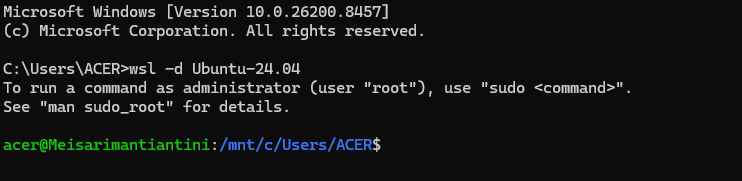

   b. acer = username
   Meisarimantiantini = hostname (nama komputer)
   /mnt/c/Users/ACER = direktori kerja saat ini
   $ = user biasa (bukan root)

2. a. 
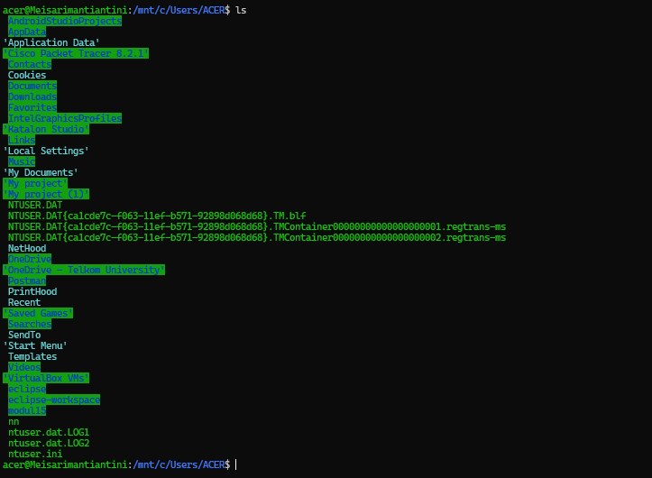

   b. Option: tidak ada
      Parameter: tidak ada
   c. Perintah ls digunakan untuk menampilkan daftar file dan direktori yang terdapat pada direktori saat ini.

   d. 
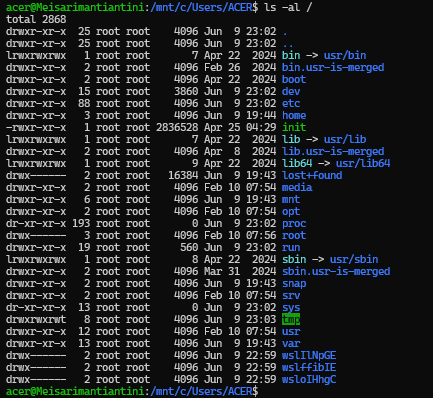

   e. Option: -al
      Parameter: /

   f. Fungsi:Menampilkan seluruh file dan direktori pada direktori root (/) secara lengkap, termasuk file tersembunyi, hak
      akses, pemilik file, ukuran file, dan waktu modifikasi.

   g. Karena:
      - ls hanya menampilkan daftar file dan folder pada direktori saat ini.
      - ls -al / menampilkan seluruh isi direktori root (/) secara detail, termasuk file tersembunyi dan informasi lengkap setiap file/direktori.

3. a. 
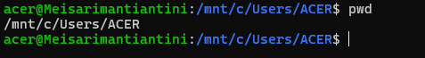

   b. Option: tidak ada
      Parameter: tidak ada

   c. Perintah pwd (Print Working Directory) digunakan untuk menampilkan lokasi direktori kerja saat ini atau direktori yang 
      sedang aktif.

4. a. 
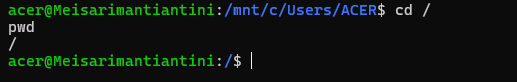

   b. Option: tidak ada
      Parameter: /

   c. Perintah cd / digunakan untuk berpindah ke direktori root (/), yaitu direktori utama pada sistem Linux yang menjadi 
      induk dari seluruh direktori lainnya.

5. a. 
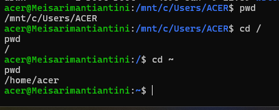
         
cd / memindahkan pengguna ke direktori root (/), yaitu direktori utama dalam sistem Linux.
cd ~ memindahkan pengguna ke home directory miliknya, yaitu /home/acer.
Dari hasil yang diperoleh terlihat bahwa setelah menjalankan cd /, direktori aktif menjadi /, sedangkan setelah menjalankan cd ~, direktori aktif berubah menjadi /home/acer.

   b. 
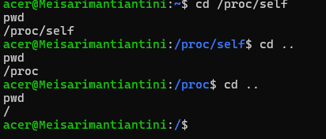

6. a. 
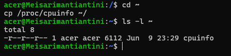

   b. 

   c. 
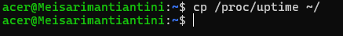

   d. 
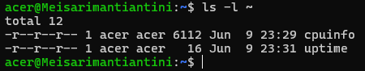

   e. 
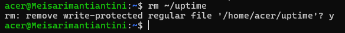

   f. 
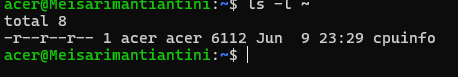

   g. 
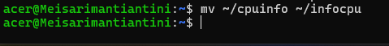

7. a. 
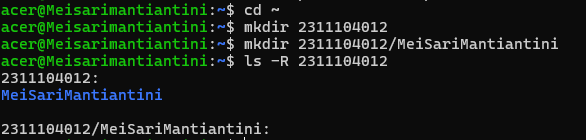
         
   b. 

8. a. 
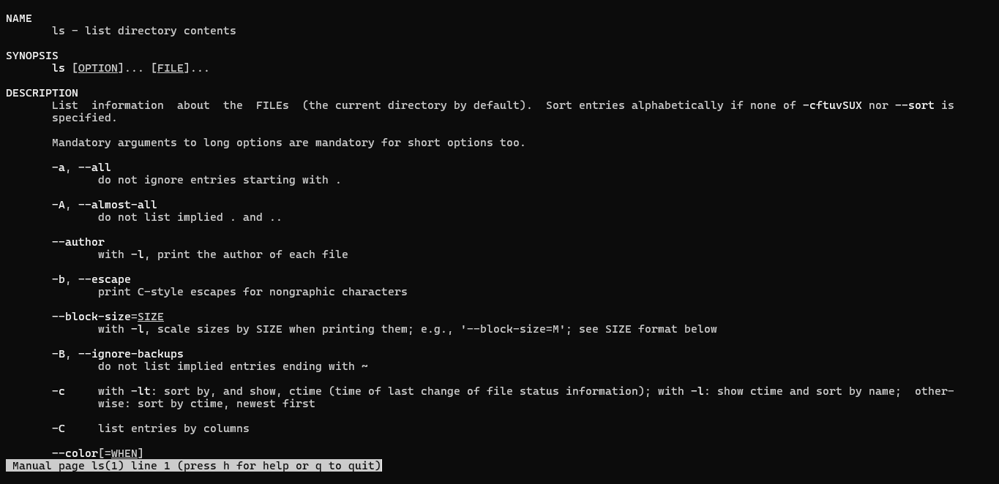

   b. Perintah ls digunakan untuk menampilkan daftar file dan direktori pada suatu direktori.
   c. Di dalam manual bagian AUTHOR biasanya tertulis: Richard M. Stallman dan David MacKenzie
   d. -h (human-readable) menampilkan ukuran file dalam format yang mudah dibaca manusia seperti KB, MB, dan GB.
   e. -R
   f. 
   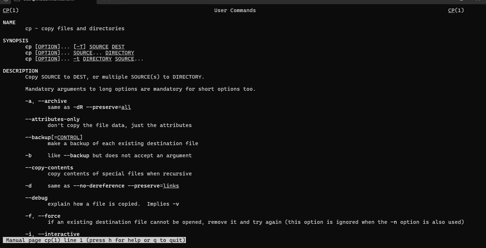

   g. Perintah cp digunakan untuk menyalin (copy) file atau direktori dari satu lokasi ke lokasi lain.
   h. Biasanya pada Ubuntu tertulis: Torbjorn Granlund, David MacKenzie, dan Jim Meyering
   i. -v (verbose) menampilkan proses penyalinan yang sedang dilakukan.
      j. -i

9. a. 
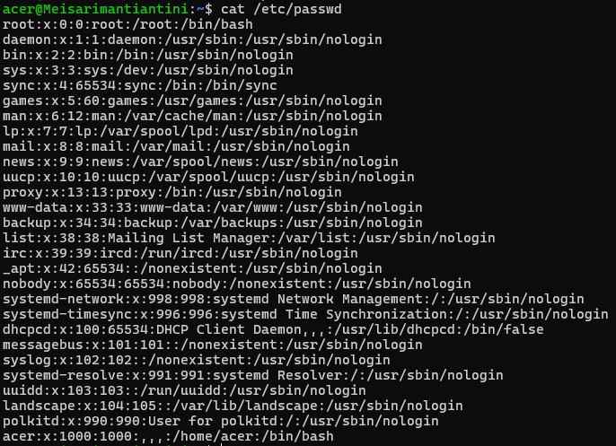

   b. Perintah cat (concatenate) digunakan untuk menampilkan isi file ke layar terminal. Selain itu, perintah cat juga dapat  
      digunakan untuk menggabungkan beberapa file dan membuat file baru.
         
   c. 
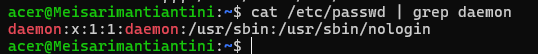

   d. 
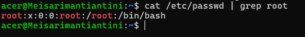

   e. 

   f. Perintah | grep daemon berfungsi untuk menyaring hasil output dan hanya menampilkan baris yang mengandung kata "daemon".
10. a. 
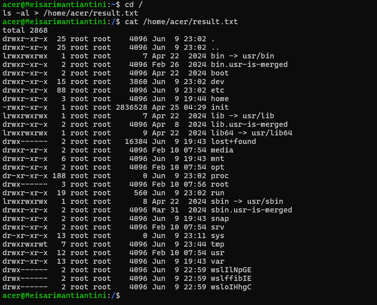

   b. /home/acer/result.txt
   c. 
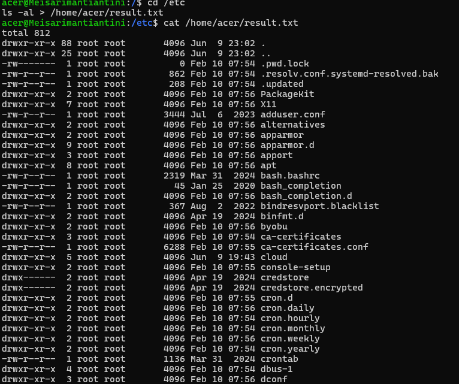

   d. Operator > digunakan untuk mengalihkan (redirect) output suatu perintah ke file dan menimpa isi file lama jika file 
      tersebut sudah ada.
   e. 
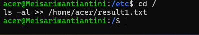

   f. 
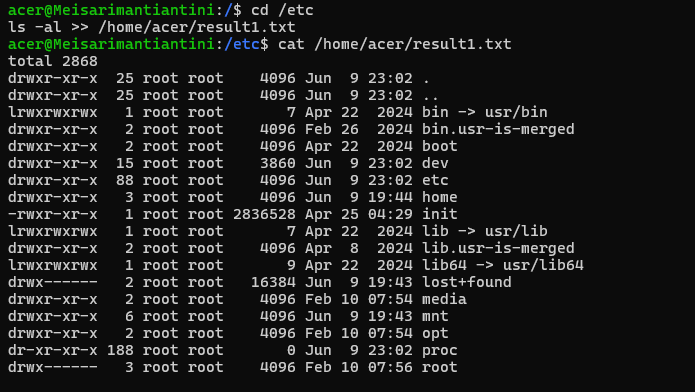

   g. > : Menulis output ke file dan menimpa isi file yang sudah ada
      >> : Menambahkan output ke akhir file tanpa menghapus isi sebelumnya

 
## C. Referensi

1. https://telkomuniversityofficial-my.sharepoint.com/shared?listurl=https%3A%2F%2Ftelkomuniversityofficial-my.sharepoint.com%2Fpersonal%2Fmaghaz_student_telkomuniversity_ac_id%2FDocuments&id=%2Fpersonal%2Fmaghaz_student_telkomuniversity_ac_id%2FDocuments%2F2026%2F00.+Modul+Praktikum+Sistem+Operasi+SE+2526-2.pdf&parent=%2Fpersonal%2Fmaghaz_student_telkomuniversity_ac_id%2FDocuments%2F2026&shareLink=1&ga=1
