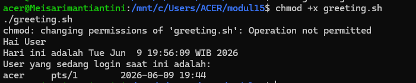
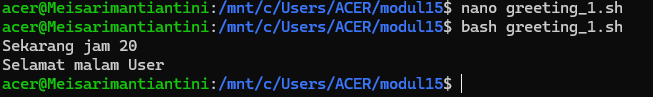
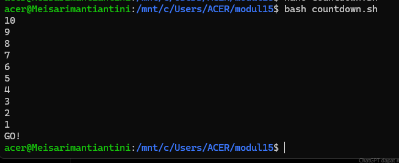
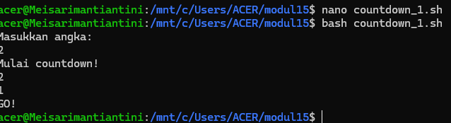
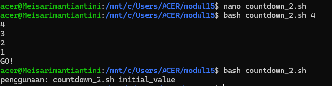
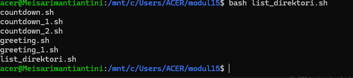

# <h1 align="center">Laporan Praktikum Modul 14   Scripting </h1>

Mei Sari Mantiantini - 2311104012

## A. Dasar Teori
 
Scripting merupakan teknik penulisan sekumpulan perintah yang disimpan dalam sebuah file dan dapat dieksekusi secara otomatis oleh sistem operasi. Pada Linux, scripting umumnya menggunakan Bash (Bourne Again Shell) yang memungkinkan pengguna mengotomatisasi berbagai tugas seperti pengelolaan file, administrasi sistem, pemrosesan data, dan eksekusi program secara berulang tanpa harus mengetik perintah satu per satu. Dengan menggunakan script, pekerjaan dapat dilakukan lebih cepat, konsisten, dan mengurangi kemungkinan kesalahan manusia. Oleh karena itu, scripting menjadi salah satu kemampuan penting dalam penggunaan sistem operasi Linux, terutama untuk administrasi sistem dan pengembangan perangkat lunak.

## B. Unguided
      1. 
      2. 
      3. 
      4. 
      5. 
      6. 
 
## C. Referensi

1. https://telkomuniversityofficial-my.sharepoint.com/shared?listurl=https%3A%2F%2Ftelkomuniversityofficial-my.sharepoint.com%2Fpersonal%2Fmaghaz_student_telkomuniversity_ac_id%2FDocuments&id=%2Fpersonal%2Fmaghaz_student_telkomuniversity_ac_id%2FDocuments%2F2026%2F00.+Modul+Praktikum+Sistem+Operasi+SE+2526-2.pdf&parent=%2Fpersonal%2Fmaghaz_student_telkomuniversity_ac_id%2FDocuments%2F2026&shareLink=1&ga=1
