# <h1 align="center">Laporan Praktikum Modul 15   Security </h1>

Mei Sari Mantiantini - 2311104012

## A. Dasar Teori
 
Keamanan sistem operasi merupakan serangkaian mekanisme yang digunakan untuk melindungi data dan sumber daya komputer dari akses, perubahan, atau penggunaan yang tidak sah. Salah satu aspek penting dalam keamanan adalah integritas data yang dapat diuji menggunakan fungsi hash seperti MD5, SHA256, dan SHA512 untuk memastikan bahwa data tidak mengalami perubahan. Selain itu, konsep avalanche effect menunjukkan bahwa perubahan kecil pada data dapat menghasilkan nilai hash yang sangat berbeda. Keamanan juga mencakup kerahasiaan data melalui proses enkripsi, seperti menggunakan EncFS untuk mengenkripsi file dan direktori, serta GPG (GNU Privacy Guard) yang menerapkan kriptografi kunci publik dan privat untuk mengamankan pertukaran informasi. Dengan penerapan hashing, enkripsi, dan manajemen kunci, sistem operasi dapat menjaga integritas, kerahasiaan, dan keamanan data secara lebih efektif.

## B. Unguided
   1. a. 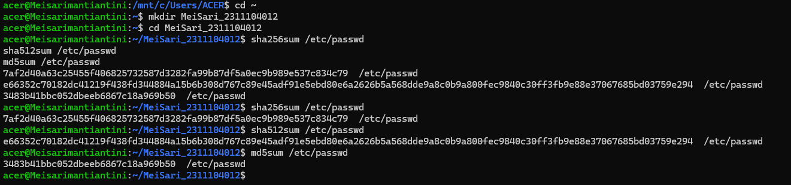
      b. 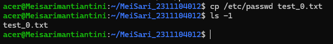
      c. 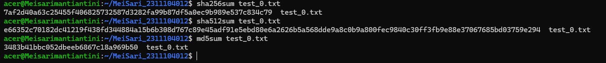
      d. 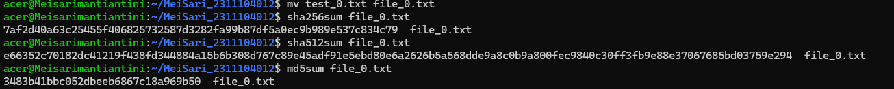
      e. Nilai hash /etc/passwd, test_0.txt, dan file_0.txt sama karena isi file tidak berubah. Proses rename hanya mengubah 
         nama file, bukan isi file sehingga hash yang dihasilkan tetap sama.
   2. a. 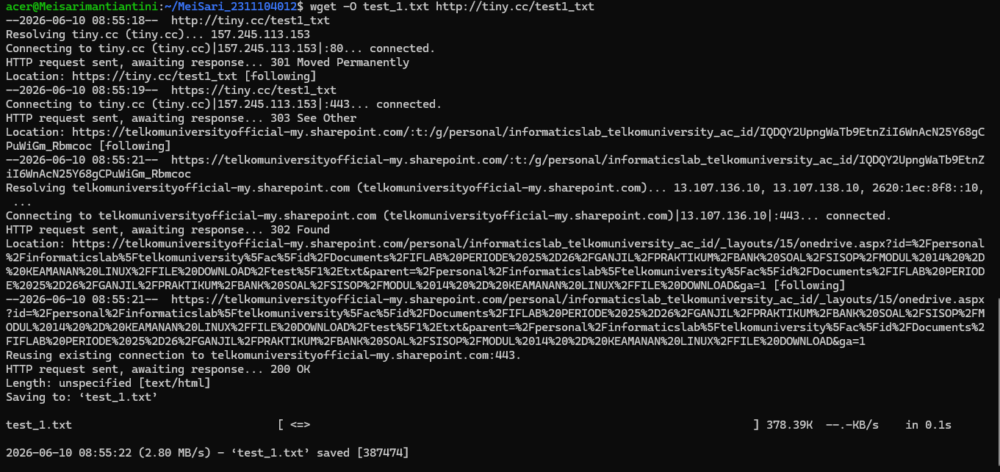
      b. 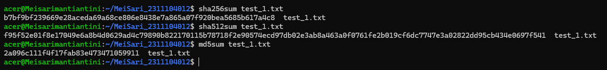
      c. 
      d. 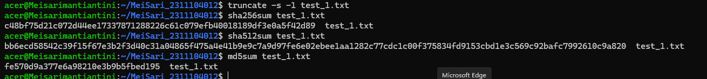
      e. Nilai hash berubah seluruhnya walaupun hanya satu karakter yang diubah. Hal ini menunjukkan sifat Avalanche Effect pada
         fungsi hash, yaitu perubahan kecil pada data menghasilkan perubahan hash yang sangat besar.
   3. a. 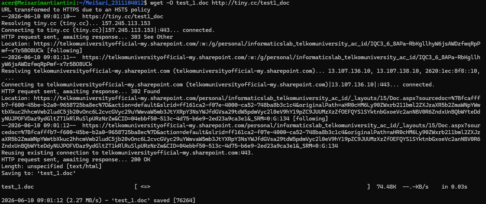
      b. 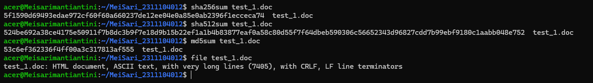
      c. 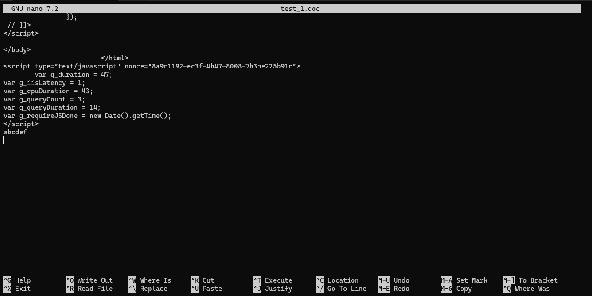
         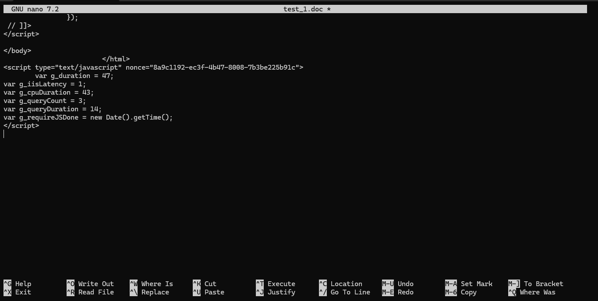
      d. 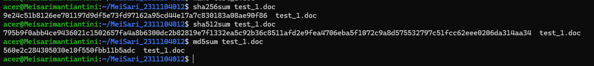
      e. Nilai hash berubah meskipun isi dokumen kembali seperti semula karena metadata file (waktu modifikasi, informasi 
         penyimpanan, dan struktur internal dokumen) ikut berubah.
   4. a. 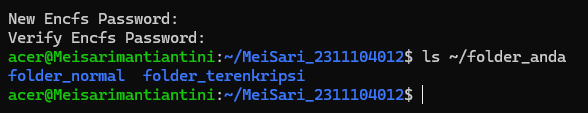
      b. 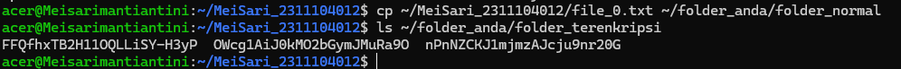
      c. 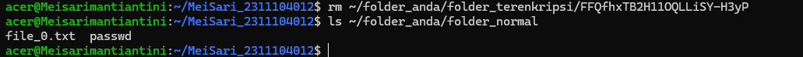
      d. 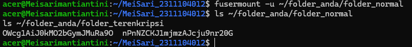
   5. a. 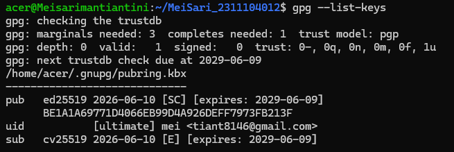
      b. 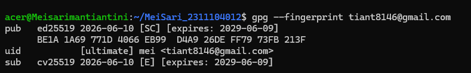
      c. 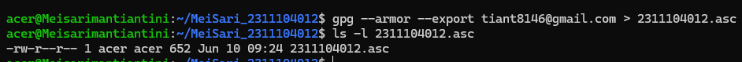
 
## C. Referensi

1. https://telkomuniversityofficial-my.sharepoint.com/shared?listurl=https%3A%2F%2Ftelkomuniversityofficial-my.sharepoint.com%2Fpersonal%2Fmaghaz_student_telkomuniversity_ac_id%2FDocuments&id=%2Fpersonal%2Fmaghaz_student_telkomuniversity_ac_id%2FDocuments%2F2026%2F00.+Modul+Praktikum+Sistem+Operasi+SE+2526-2.pdf&parent=%2Fpersonal%2Fmaghaz_student_telkomuniversity_ac_id%2FDocuments%2F2026&shareLink=1&ga=1